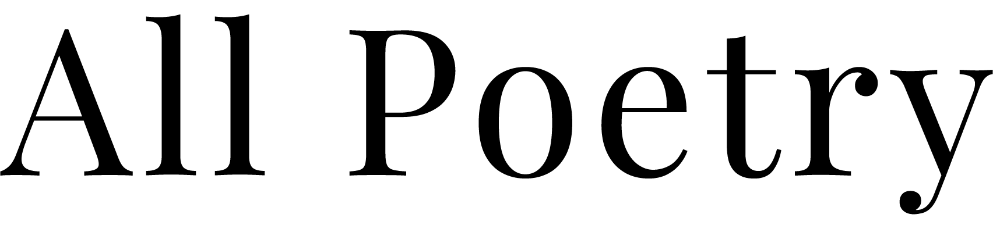

<p align="center">
  <a href="" rel="noopener">
    
 </a>
</p>

<p align="center">
  <a href="" rel="noopener">
    
 </a>
</p>

<div align="center">

[]()
[](https://github.com/arthurdjn/allpoetry/issues)
[](https://github.com/arthurdjn/allpoetry/pulls)
[](/LICENSE)

</div>

---

<p align="center"> 
    A simple Python API for <a href="https://allpoetry.com" target="blank">allpoetry.com</a>. 
    <br>
    Retrieve poems, authors and more in a few line of code.
    <br> 
</p>

## 📝 Table of Contents

-   [About](#about)
-   [Getting Started](#getting_started)
-   [Usage](#usage)
-   [TODO](#todo)
-   [Authors](#authors)
-   [Acknowledgments](#acknowledgement)

## 🧐 About <a name = "about"></a>


This project is the continuation of [allpoetryapi](https://github.com/jmbhughes/allpoetryapi) project from [@jmbhughes](https://github.com/jmbhughes). I simply clean up the code and updated some parts that were broken. I also changed the project structure, and added utilities functions.

## 🏁 Getting Started <a name = "getting_started"></a>

These instructions will get you a copy of the project up and running on your local machine for development and testing purposes. See [usage](#usage) for notes on how to use the package.

### Prerequisites

**allpoetry** requires scraping libraries to work.

* `requests`
* `beautiful soup 4`
* `lxml`
* `re`
* `dateutil`

### Installing

To install the package, simply clone the repository and execute the `setup.py`.

```
git clone https://github.com/arthurdjn/allpoetry
cd allpoetry
pip install .
```


## 🎈 Usage <a name="usage"></a>

Follow these notes to work with **allpoetry** package.

### API

Connect to the python API to send your requests, and get the appropriate response. 

```python
from allpoetry import AllPoetry

# Optional, but recommended
USERNAME = "your_username"
PASSWORD = "your_password"

# Connect to the API
api = AllPoetry(USERNAME, PASSWORD)
```

### Retrieve a specific Poem

Retrieve a **poem** from its `url`.

```python
url = "https://allpoetry.com/poem/8498499-Mirror-by-Sylvia-Plath"
poem = api.get_poem_from_url(url)

print(poem)
```

```
Mirror
¯¯¯¯¯¯

“I am silver and exact. I have no preconceptions.
Whatever I see I swallow immediately
Just as it is, unmisted by love or dislike.
I am not cruel, only truthful
The eye of a little god, four cornered.
Most of the time I meditate on the opposite wall.
It is pink, with speckles. I have looked at it so long
I think it is part of my heart. But it flickers.
Faces and darkness separate us over and over.

Now I am a lake. A woman bends over me,
Searching my reaches for what she really is.
Then she turns to those liars, the candles or the moon.
I see her back, and reflect it faithfully.
She rewards me with tears and an agitation of hands.
I am important to her. She comes and goes.
Each morning it is her face that replaces the darkness.
In me she has drowned a young girl, and in me an old woman
Rises toward her day after day, like a terrible fish.”

— Sylvia Plath
  Likes: 229, Views: 355,300
```

#### Get the Author

You can retrieve the **author** with:

```python
author = poem.author
print(author)
```

```
Sylvia-Plath
```

#### Get the Title

You can retrieve the **title** with:

```python
title = poem.title
print(title)
```

```
Mirror
```

#### Get the Text

You can retrieve the **text** with:

```python
text = poem.text
print(text)
```

```
I am silver and exact. I have no preconceptions.
Whatever I see I swallow immediately
Just as it is, unmisted by love or dislike.
# [...]
```

#### Others

You can retrieve **likes** with:

```python
likes = poem.likes
```

You can retrieve **views** with:

```python
views = poem.views
```

You can retrieve **tags** with:

```python
tags = poem.tags
```

### Retrieve all Poems

You can of course retrieve all poems corresponding to an author.

The `top_k` parameter is used to control the number of retrieved poems. If provided, you will get maximum `top_k` poems otherwise all poems will be returned.

```python
poems = api.get_poems(AUTHOR_NAME, top_k=100)
```

### Retrieve famous authors

You can also retrieve famous authors, or users with:

```python
authors = api.get_famous_authors(top_k=100)

author = api.get_author(AUTHOR_NAME)
```

### Save your Poems

To save your poems, you can simply use `pickle`, a standard package for writing / loading binary files.

```python
with open(f"{AUTHOR_NAME}.pkl", "wb") as file:
    pickle.dump(poems, file)
```

## 🔧 TODO <a name = "toto"></a>

* Add similar authors feature
* jsonify a poem
* retrieve a poem from its title and author (?)
* ~~Add famous authors feature~~ ✔️

## ✍️ Authors <a name = "authors"></a>

*   [@arthurdjn](https://github.com/arthurdjn) - Updates and improvements


## 🎉 Acknowledgements <a name = "acknowledgement"></a>

* Hat tip to [@jmbhughes](https://github.com/jmbhughes) whose code was initially used
